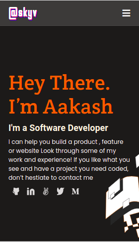
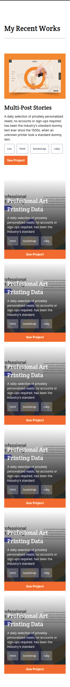
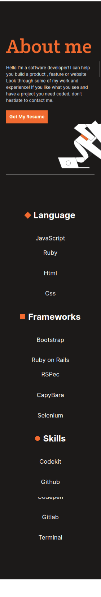
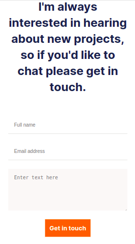
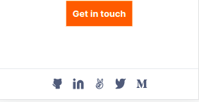
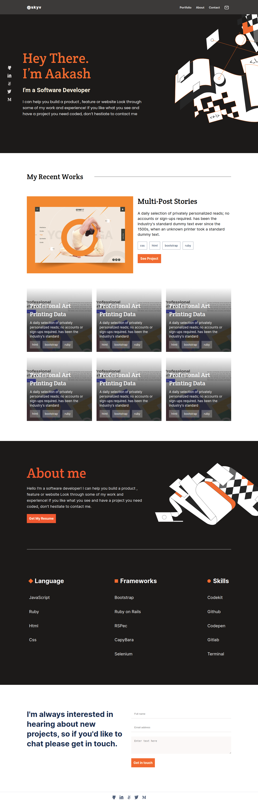

# Personal Portfolio

> Personal portfolio project for learning purposes.

## Built With

- HTML5
- CSS3 [Flexbox, Box Model, Background and Image]
- Linters
- Vector Graphics

## Live Demo (if available)

[Live Demo Link](https://skyv26.github.io/portfolio/)

## Getting Started

In order to use the files you should have to clone it and then follow the instruction given below.

### Prerequisites
 - Good Knowlege on HTML and CSS (Flexbox, Box-Model, Background style and Image Tag)
 - Install Node.js, Npm Copy the linters from
   https://github.com/microverseinc/linters-config/tree/master/html-css

### Setup
    use "git clone https://github.com/skyv26/portfolio.git"

## Authors

👤 **Aakash Verma**

- GitHub: [@skyv26](https://github.com/skyv26)

## Screenshot

  
Challenged Design (Mobile Version)

  
  

    
    
    
    
    
  

   

Challenged Design (Desktop Version)

  
  

    
  

## 📝 License

This project is [MIT](./LICENSE) licensed.
